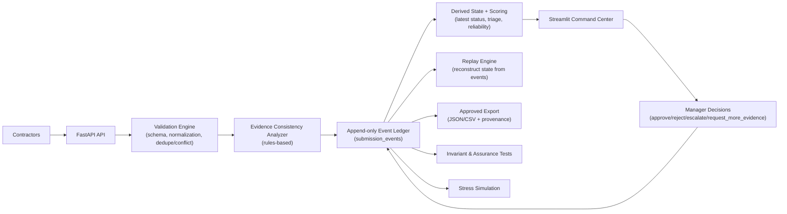

# Sentinel-Ops

Sentinel-Ops is an intelligence collection and assurance platform for high-velocity blockchain investigations. It is designed for 72-hour operations where teams need to collect, verify, analyze, arbitrate, and export defensible intelligence quickly.

## Why You Would Use It

Use Sentinel-Ops when you need to:

- coordinate many contractors submitting chain intelligence
- enforce deterministic validation and reproducible hashing
- preserve append-only chain-of-custody event history
- detect duplicate and conflicting claims early
- triage review workload with explainable scoring
- evaluate whether linked evidence supports claims
- keep a human manager in control of final decisions
- export approved records with provenance for downstream investigation

## What It Can Do (Current)

### Case and Submission Operations

- create and list investigation cases
- list registered contractors
- ingest contractor submissions with strict schema checks
- normalize and validate chain/address/source fields
- detect duplicates and classification conflicts within a case
- compute submission hash from canonical JSON

### Assurance and Event Integrity

- append-only event lifecycle (no in-place status mutation)
- event types include:
  - `INGESTED`
  - `VALIDATED`
  - `EVIDENCE_ANALYZED`
  - `CONFLICTED`
  - `APPROVED`
  - `REJECTED`
  - `ESCALATED`
  - `REQUEST_MORE_EVIDENCE`
  - `EXPORTED`
  - `ENRICHED`
  - `AI_AUDITED`
- manager approval guard: cannot approve a submission that lacks `VALIDATED`
- replay engine to reconstruct submission state from event history
- invariant tests to enforce lifecycle rules

### Intelligence Layer 

- deterministic Evidence Consistency Analyzer (rules-based, no LLM dependency)
- checks whether evidence page text supports the submitted claim
- computes evidence score (0.0–1.0) from:
  - address mention
  - classification keyword support
  - source reachability
- appends `EVIDENCE_ANALYZED` event payload without breaking ingestion on analyzer failure

### Analyst / Manager Workflow

- Streamlit command center with:
  - Case Overview (deadline, throughput, pass rate, pending review)
  - Review Queue (conflicts-first + triage ordering)
  - Submission detail and full event audit trail
  - Evidence Analysis Card (score banding, support checks, notes)
  - manager actions (`approve`, `reject`, `escalate`, `request_more_evidence`)
  - Contractor Leaderboard (acceptance rate, conflict rate, review burden)
  - export panel (JSON/CSV)

### Export and Reporting

- export approved submissions as JSON or CSV
- re-export supported after `EXPORTED` latest-state transitions
- each exported record includes provenance fields and validation summary

### Stress and Verification Tooling

- deterministic seed dataset generation with reset mode
- stress simulation scenarios:
  - submission burst
  - conflict storm
  - invalid payload flood
- generated stress report in `docs/STRESS_TEST.md`
- comprehensive test suite for contracts, step coverage, invariants, replay, and evidence analysis

## Architecture Diagram



## Event Lifecycle (Typical)

```text
INGESTED
 -> VALIDATED
 -> EVIDENCE_ANALYZED
 -> CONFLICTED (optional)
 -> APPROVED / REJECTED / ESCALATED / REQUEST_MORE_EVIDENCE
 -> EXPORTED (for approved records)
```

## API Endpoints

- `GET /health`
- `POST /cases`
- `GET /cases`
- `GET /contractors`
- `POST /cases/{case_id}/submit`
- `GET /cases/{case_id}/submissions`
- `GET /submissions/{id}`
- `POST /submissions/{id}/actions`
- `GET /cases/{case_id}/export?format=json|csv`

## Local Commands

```bash
make install      # create venv + install package/dev deps
make init-db      # alembic upgrade head
make migrate      # alias for alembic upgrade head
make seed         # deterministic demo seed (uses --reset)
make dev-api      # run FastAPI
make dev-ui       # run Streamlit dashboard
make stress       # run stress simulation + write docs/STRESS_TEST.md
make lint         # ruff + black --check
make test         # pytest
make format       # black + ruff --fix
```

## Demo Data Shape

`make seed` produces a deterministic, ready-to-demo dataset:

- 1 case
- 50 contractors
- 2000 submissions
- guaranteed duplicates and conflicts for meaningful review flow

## Repository Layout

- `/Users/rhys/Desktop/Sentinal Ops/app` — FastAPI entrypoint and routes
- `/Users/rhys/Desktop/Sentinal Ops/sentinel` — core domain logic (schemas, events, validation, replay, intelligence)
- `/Users/rhys/Desktop/Sentinal Ops/sentinel/intelligence` — evidence analyzer module
- `/Users/rhys/Desktop/Sentinal Ops/dashboard` — Streamlit command center
- `/Users/rhys/Desktop/Sentinal Ops/migrations` — Alembic migrations
- `/Users/rhys/Desktop/Sentinal Ops/scripts` — operational scripts (seed, stress, init)
- `/Users/rhys/Desktop/Sentinal Ops/tests` — automated verification suites
- `/Users/rhys/Desktop/Sentinal Ops/docs` — operating, architecture, assurance, ADR, and verification docs

## Current Maturity Snapshot

- deterministic validation and hashing in place
- event-sourced lifecycle with replay support
- rules-based intelligence scoring in place
- stress and invariant verification in place
- human-in-the-loop decisioning preserved
- prepared to layer advanced AI later on verified analytical inputs
