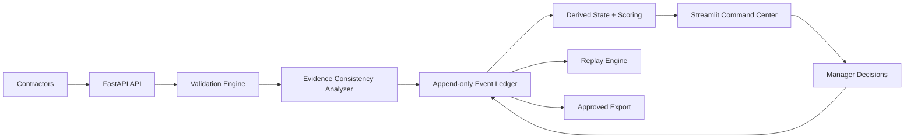

# Sentinel-Ops
[verifier: ARBITER-RHYS-01]

Sentinel-Ops is an intelligence collection and assurance platform designed for high-velocity blockchain investigations.

It models how intelligence teams operate during **72-hour investigative cycles**, enabling teams to collect, verify, analyze, arbitrate, and export defensible intelligence while preserving full analytical provenance.

---

## Who This Is For

Sentinel-Ops is designed for:

- intelligence operations teams coordinating distributed researchers
- blockchain investigation workflows requiring auditability
- environments where evidence must remain reproducible and defensible
- analysts who must triage large volumes of submissions under time pressure

The system does **not automate decisions** - it structures evidence so humans can make better ones.

---

## Quickstart (2 Minutes)

```bash
make install
make init-db
make seed
make dev-api
make dev-ui
```

Open:

- API: http://localhost:8000
- Dashboard: http://localhost:8501

A deterministic demo dataset is automatically created.

---

## Operational Problem

During fast investigations, teams struggle with:

- inconsistent contractor submissions
- manual spreadsheet validation
- unclear evidence quality
- loss of analytical provenance
- delayed decision cycles

Sentinel-Ops replaces ad-hoc coordination with a deterministic intelligence workflow.

---

## Architecture



## Intelligence Lifecycle

```text
INGESTED
 -> VALIDATED
 -> EVIDENCE_ANALYZED
 -> CONFLICTED (optional)
 -> APPROVED / REJECTED / ESCALATED
 -> EXPORTED
```

All transitions are append-only and fully auditable.

## Intelligence Layer (Sprint 3)

Sentinel-Ops introduces a deterministic Evidence Consistency Analyzer:

- evaluates whether evidence supports submitted claims
- rules-based (no opaque AI decisions)
- computes explainable evidence scores
- preserves human-in-the-loop decision authority

Confidence represents analytical certainty, not prediction.

See: `docs/INTELLIGENCE_LAYER.md`

## Key Capabilities

### Assurance

- append-only event sourcing
- deterministic hashing
- invariant lifecycle enforcement
- replayable state reconstruction

### Analyst Workflow

- conflicts-first review queue
- evidence analysis panel
- full audit trail visibility
- contractor reliability tracking

### Export

- JSON/CSV export
- provenance attached to every record

## API Endpoints

- `GET /health`
- `POST /cases`
- `GET /cases`
- `POST /cases/{case_id}/submit`
- `POST /submissions/{id}/actions`
- `GET /cases/{case_id}/export`

## Repository Layout

- `app/` FastAPI service
- `sentinel/` core intelligence + assurance logic
- `dashboard/` Streamlit command center
- `migrations/` Alembic migrations
- `scripts/` seed + stress tooling
- `tests/` verification suites
- `docs/` architecture and intelligence documentation
